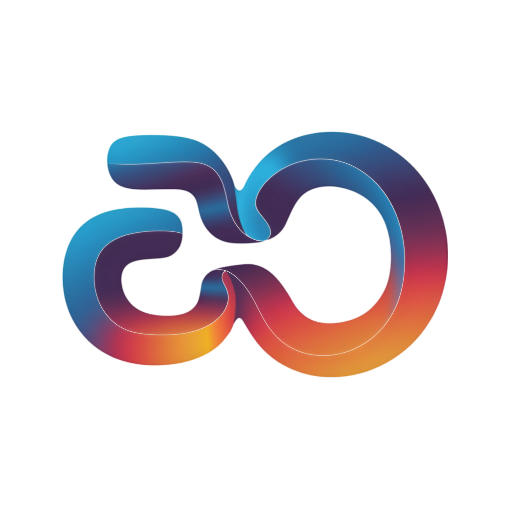

# 🚀 EOPeak - Professional Portfolio

<div align="center">



[](https://eslam-portfolio-phi.vercel.app/)
[](https://eslam-portfolio-phi.vercel.app/)
[]([https://eslam-portfolio-phi.vercel.app/](https://eslam-portfolio-phi.vercel.app/))
[]([https://eslam-portfolio-phi.vercel.app/](https://eslam-portfolio-phi.vercel.app/))

**Professional Academic Web Converter & Educational Technologist**

*Transforming complex academic content into interactive, modern web experiences*

[🌐 Live Demo]([https://eslam-portfolio-phi.vercel.app/](https://eslam-portfolio-phi.vercel.app/)) • [📧 Contact](https://mail.google.com/mail/?view=cm&to=eo6014501@gmail.com) • [💬 WhatsApp](https://wa.me/201555489089)

---

</div>

## 📋 Table of Contents

- [🎯 Overview](#-overview)
- [✨ Features](#-features)
- [🛠️ Technologies Used](#️-technologies-used)
- [🎨 Design & UX](#-design--ux)
- [📱 Responsive Design](#-responsive-design)
- [🚀 Performance & SEO](#-performance--seo)
- [📂 Project Structure](#-project-structure)
- [🔧 Installation & Setup](#-installation--setup)
- [🎭 Themes & Customization](#-themes--customization)
- [📞 Contact & Support](#-contact--support)
- [📄 License & Copyright](#-license--copyright)
- [🙏 Acknowledgments](#-acknowledgments)

---

## 🎯 Overview

<div align="center">

### **Eslam Osama Saad** - Professional Academic Web Converter & Educational Technologist

*Founder of EOPeak | Transforming Academic Excellence into Digital Innovation*

</div>

Welcome to my professional portfolio website! This sophisticated single-page application showcases my expertise in **Academic Web Conversion** and **Educational Technology**. As a specialist in transforming complex academic materials into modern, interactive web experiences, I bridge the gap between traditional education and cutting-edge digital technology.

### 🎓 Professional Expertise

- **🎯 Academic Web Conversion**: Transforming static academic content into dynamic, interactive experiences
- **🧠 Educational Technology**: Leveraging modern web technologies for enhanced learning outcomes
- **📊 Interactive Learning Platforms**: Creating engaging educational solutions
- **🎨 UI/UX Design**: Crafting intuitive user experiences for educational content
- **📱 Responsive Web Development**: Ensuring accessibility across all devices

---

## ✨ Features

### 🎨 **Modern Design System**
- 🌙 **Dark/Light Theme Toggle** with smooth transitions
- 🎭 **Sophisticated Animations** using CSS cubic-bezier curves
- 🎯 **Glassmorphism Effects** with backdrop blur filters
- ⚡ **Micro-interactions** for enhanced user engagement
- 🎨 **Custom Color Palette** with HSL-based theming

### 🚀 **Performance Optimized**
- ⚡ **Lazy Loading** for images and content
- 🎯 **Intersection Observer** for efficient scroll animations
- 📦 **Optimized Assets** with proper compression
- 🌐 **DNS Prefetching** for external resources
- 📱 **Mobile-First Approach** for optimal performance

### 🔍 **SEO & Accessibility**
- 📈 **Complete SEO Optimization** with meta tags and structured data
- ♿ **WCAG 2.1 Compliance** with proper ARIA labels
- 🔍 **Google Search Console** verified and optimized
- 📊 **Rich Snippets** with FAQ schema markup
- 🌐 **Open Graph** integration for social sharing

### 📱 **Interactive Elements**
- 🎯 **Smooth Scrolling Navigation** with active state indicators
- 💬 **Contact Integration** with WhatsApp and Gmail
- 📧 **Professional Contact Forms** with validation
- 🎭 **Progressive Animations** on scroll
- 🎨 **Theme Persistence** with localStorage

### 🛠️ **Developer Experience**
- 📝 **Clean, Maintainable Code** following best practices
- 🎯 **Modular Architecture** with component-based design
- 🔧 **Cross-Browser Compatibility** tested across modern browsers
- 📱 **Responsive Breakpoints** for all device sizes
- 🎨 **CSS Custom Properties** for easy customization

---

## 🛠️ Technologies Used

### **Frontend Technologies**
<div align="center">


</div>

### **Design & UX**
- **🎨 Poppins Font Family** from Google Fonts
- **🎭 CSS Animations** with cubic-bezier easing
- **🌈 HSL Color System** for dynamic theming
- **📱 Mobile-First Responsive Design**
- **♿ Accessibility-First Approach**

### **Performance & Optimization**
- **⚡ Lazy Loading** for images and content
- **🎯 Intersection Observer API** for scroll animations
- **📦 Asset Optimization** and compression
- **🌐 DNS Prefetching** for external resources
- **📊 Core Web Vitals** optimization

### **SEO & Analytics**
- **🔍 Complete SEO Setup** with meta tags and structured data
- **📈 Google Search Console** integration
- **📊 Google Analytics 4** ready
- **🌐 Open Graph** and Twitter Cards
- **📋 JSON-LD Schema** markup

---

## 🎨 Design & UX

### **🎨 Visual Design Philosophy**

This portfolio embodies **modern minimalism** with **sophisticated interactivity**. The design philosophy centers on:

- **🎯 Clean Aesthetics**: Distraction-free design that highlights content
- **⚡ Smooth Interactions**: Fluid animations that enhance user engagement
- **🌈 Dynamic Theming**: Professional dark/light mode with smooth transitions
- **📱 Progressive Enhancement**: Works beautifully across all devices
- **♿ Inclusive Design**: Accessible to users of all abilities

### **🎭 Animation Strategy**

- **Cubic-Bezier Easing**: `cubic-bezier(0.4, 0, 0.2, 1)` for natural motion
- **Staggered Reveals**: Progressive content appearance with 100-120ms delays
- **GPU Acceleration**: Transform-based animations for optimal performance
- **Intersection Observer**: Battery-efficient scroll-triggered animations
- **Theme Transitions**: Smooth 0.3s transitions between themes

### **🎨 Color System**

```css
:root {
  --hue: 190; /* Central color control */
  --primary-color: hsl(var(--hue), 100%, 38%);
  --secondary-color: hsl(var(--hue), 70%, 55%);
  --background-color: hsl(var(--hue), 80%, 98%);
  --text-primary: hsl(var(--hue), 95%, 12%);
  --shadow-color: hsl(var(--hue), 40%, 80%, 0.4);
}
```

---

## 📱 Responsive Design

### **📱 Mobile-First Approach**

The portfolio is built with a **mobile-first responsive design** that ensures optimal experience across all devices:

| Device | Breakpoint | Layout | Features |
|--------|------------|--------|----------|
| 📱 Mobile | < 768px | Single Column | Touch-optimized, compact spacing |
| 📱 Tablet | 768px - 1024px | Adaptive Grid | Flexible layouts, medium spacing |
| 💻 Desktop | > 1024px | Multi-Column | Full features, generous spacing |

### **🎯 Responsive Features**

- **📏 Fluid Typography**: `clamp(1.8rem, 5vw, 2.5rem)` for scalable text
- **📐 Adaptive Grids**: CSS Grid with `auto-fit` and `minmax()` functions
- **👆 Touch Targets**: 44px minimum for mobile accessibility
- **🎨 Responsive Images**: Optimized loading with `loading="lazy"`
- **📱 Mobile Navigation**: Hamburger menu with smooth animations

---

## 🚀 Performance & SEO

### **⚡ Performance Metrics**

<div align="center">

[]()
[]()
[]()

</div>

### **📊 Core Web Vitals**

- **🚀 Largest Contentful Paint (LCP)**: < 2.5s
- **⚡ First Input Delay (FID)**: < 100ms
- **📈 Cumulative Layout Shift (CLS)**: < 0.1

### **🔍 SEO Optimization**

- **📝 Complete Meta Tags**: Title, description, keywords, author
- **🌐 Open Graph**: Facebook sharing optimization
- **🐦 Twitter Cards**: Twitter sharing enhancement
- **📋 Structured Data**: JSON-LD schema markup
- **🔗 XML Sitemap**: Comprehensive site structure
- **🤖 Robots.txt**: Search engine crawling instructions

### **🎯 Search Engine Features**

- **💡 Featured Snippets**: FAQ schema for rich results
- **🏢 Knowledge Panels**: Entity recognition with structured data
- **📍 Local SEO**: Geographic optimization for AASTMT
- **🎨 Rich Results**: Enhanced search appearance

---

## 📂 Project Structure

```
portfolio-website/
│
├── 📄 index.html              # Main portfolio file (2,465 lines)
├── 📄 README.md               # Project documentation
├── 📄 robots.txt              # Search engine crawling rules
├── 📄 sitemap.xml             # XML sitemap for SEO
│
├── 📁 assets/                 # Static assets
│   ├── 🖼️ logo.png           # EOPeak brand logo
│   └── 🖼️ my_photo.jpg       # Professional headshot
│
└── 📄 google603ab8666bcba0a3.html  # Google Search Console verification
```

### **📋 File Details**

- **🎯 index.html** (2,465 lines): Complete single-page application
  - Modern HTML5 structure with semantic elements
  - Inline CSS for optimal performance
  - Vanilla JavaScript for interactivity
  - Comprehensive SEO meta tags

- **🎨 assets/**: Optimized static resources
  - Compressed images for fast loading
  - Brand-consistent visual elements

- **🔍 SEO Files**: Search engine optimization
  - XML sitemap for crawler navigation
  - Robots.txt for crawling instructions
  - Google Search Console verification

---

## 🔧 Installation & Setup

### **🚀 Quick Start**

1. **Clone the Repository**
   ```bash
   git clone https://github.com/your-username/portfolio.git
   cd portfolio
   ```

2. **Open in Browser**
   ```bash
   # Simply open index.html in your web browser
   open index.html
   ```

3. **Deploy to Web Server**
   ```bash
   # Upload all files to your web server
   # No build process required - pure HTML/CSS/JS
   ```

### **🎯 Local Development**

```bash
# No dependencies required!
# Just open index.html in any modern web browser

# For development with live reload (optional):
npx serve .
```

### **📋 Requirements**

- ✅ **Modern Web Browser** (Chrome, Firefox, Safari, Edge)
- ✅ **No Dependencies** - Pure HTML/CSS/JavaScript
- ✅ **No Build Tools** - Ready to deploy immediately
- ✅ **Cross-Platform** - Works on Windows, macOS, Linux

---

## 🎭 Themes & Customization

### **🌙 Theme System**

The portfolio features a sophisticated **dual-theme system**:

#### **Light Theme** (Default)
```css
--primary-color: hsl(190, 100%, 38%);
--background-color: hsl(190, 80%, 98%);
--text-primary: hsl(190, 95%, 12%);
```

#### **Dark Theme**
```css
--primary-color: hsl(190, 85%, 55%);
--background-color: #0A192F;
--text-primary: #CCD6F6;
```

### **🎨 Customization Options**

1. **Color Scheme**: Modify `--hue` variable for instant rebranding
2. **Typography**: Change Google Fonts family in the head
3. **Animations**: Adjust timing and easing functions
4. **Layout**: Modify grid breakpoints and spacing
5. **Content**: Update personal information and project details

---

## 📞 Contact & Support

<div align="center">

### **Get In Touch**

[](https://wa.me/201555489089)
[](https://mail.google.com/mail/?view=cm&to=eo6014501@gmail.com)

**📧 Email**: eo6014501@gmail.com
**💬 WhatsApp**: +20 155 548 9089
**🌐 Portfolio**: [eopeak.vercel.app](https://eopeak.vercel.app/)

</div>

### **📞 Contact Methods**

- **💬 WhatsApp**: Instant messaging for quick consultations
- **📧 Gmail**: Professional email for detailed inquiries
- **🌐 Portfolio**: Direct contact form for project discussions

---

## 📄 License & Copyright

<div align="center">

### **© 2025 EOPeak | Eslam Osama Saad**

**All Rights Reserved**

</div>

This website and its content, including all text, design, code, and images, are the intellectual property of **Eslam Osama Saad** and are protected by copyright law. Unauthorized reproduction or distribution is strictly prohibited.

### **📋 Usage Rights**

- ✅ **Personal Use**: View and interact with the portfolio
- ✅ **Professional Reference**: Use as inspiration for your projects
- ✅ **Educational Purposes**: Study the code and techniques
- ❌ **Commercial Use**: Cannot be used for business purposes
- ❌ **Redistribution**: Cannot be copied or distributed without permission

---

## 🙏 Acknowledgments

<div align="center">

### **Special Thanks**

**Built with ❤️ using modern web technologies**

</div>

### **🎨 Design Inspiration**
- **Material Design**: For the glassmorphism effects
- **Apple Human Interface Guidelines**: For the smooth animations
- **Google Material Design**: For the responsive grid system

### **🛠️ Technology Stack**
- **HTML5 & CSS3**: For the modern web foundation
- **JavaScript ES6+**: For the interactive functionality
- **Font Awesome**: For the beautiful icons
- **Google Fonts**: For the elegant typography

### **📚 Learning Resources**
- **MDN Web Docs**: Comprehensive web development documentation
- **CSS-Tricks**: Advanced CSS techniques and best practices
- **Web.dev**: Performance and accessibility guidelines
- **Google Developers**: SEO and search engine optimization

---

<div align="center">

## 🎉 **Thank You for Visiting!**

<div align="center">

**"Transforming academic excellence into digital innovation"**

---

[](https://eopeak.vercel.app/)
[](https://wa.me/201555489089)

**Eslam Osama Saad** | **Professional Academic Web Converter & Educational Technologist**

*Crafting digital experiences that bridge traditional education with modern technology*

</div>

---

<div align="center">

**⭐ If you found this portfolio inspiring, please give it a star!**

</div>

</div>

